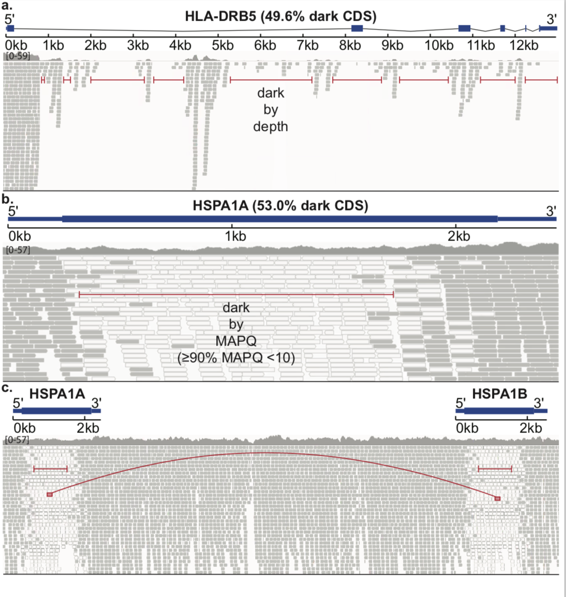
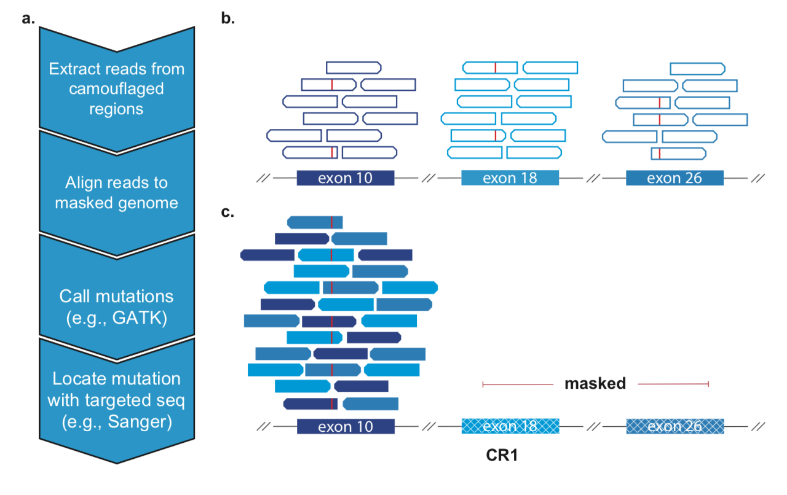

# Systematic analysis of dark and camouflaged genes

We present a list of dark and camouflaged genes and .bed files specifying their genomic coordinates. 
We provide scripts on how these regions were defined and a pipeline on how to rescue variants from
these regions in short-read data. 

Check out our preprint, [here](https://www.biorxiv.org/content/10.1101/514497v1).

---

## What are dark genes?

Dark regions of the genome are those that cannot be adequately assembled or aligned using standard
short-read sequncing technologies, preventing researchers from calling mutations in these regions.
We define two subclasses of dark regions: 'dark by depth' (where ≤ 5 reads map to the region)
and 'dark by MAPQ' (where reads align but ≥ 90% of reads have MAPQ < 10). A specific subset of dark
by MAPQ genes are camouflaged genes, dark genes that are the result of duplication events in the genome.

The IGV pile-ups above show examples of these dark regions. **a)** HLA-DRB5 is dark by depth, because
no reads align to this region. **b)** HSPA1A is dark by MAPQ because reads align, but all the reads
that do have poor MAPQ and would be filtered out by variant callers. **c)** The reason HSPA1A is dark
by MAPQ is because of a gene duplication event: it is camouflaged by HSPA1B. The two genes are nearly
identical so aligners can't determine from which gene a read originated.

We discovered dark regions are increasingly prevelant across the human genome. Based on standard
whole-genome Illumina sequencing data, we identified 36794 dark regions in 6054 gene bodies (3804
protein-coding) from pathways important to human health, development, and reproduction. Of the 6054
gene bodies, 527 (8.7%) were 100% dark (117 protein-coding) and 2128 (35.2%) were ≥5% dark (592
protein-coding). We found 2855 dark regions were in protein-coding exons (CDS) across 748 genes.
Many of these genes are important to human health and disease. 

We have also developed an algorithm to resolve most of these camouflaged regions in short-read data. Here
we apply it to the Alzhiemer's Disease Sequencing Project (ADSP) whole exome case control study.
We provide the scripts we used to characterize these regions and apply our algorithm to ADSP.

As a proof of concept, we used these methods to find a variant in ADSP present in 5 Alzhiemers Disease cases, but 0
controls in the CR1 gene (a top AD gene that is also 26% dark CDS )

---

## Running our analysis

We have divided up our scripts into 11 distinct steps found in the scripts directory. These steps
can broadly be placed into 3 categories. **1.** Steps 00-05 are used to caracterize dark regions and create
the .bed files used in our analysis pipeline. **2.** Steps 06-10 contain the scripts we used to call camo
variants in ADSP. Finally, **3.** step 11 contains all the scripts used to plot figures for our manuscript. 

Each step should be self contained, but may depend on the output of previous steps. With in each
step directory there is a **submit.sh** script, that will automate the running of all the scripts for
that step. At the top of the submit script is an in-depth description of what each step is doing, as 
well as a list of entry points required for that step. **Before running a submit.sh script be sure
to update the entry points at the beginning of that script**.

A brief outline of each step is summarized below:

* **00\_GET\_BAMS** Scripts used to align Fastq reads from 10X and ONT and to realign all bams to the
  three different genome builds (b37, hg38, hg38+alt).

* **01\_RUN\_DRF** Scripts used to run the [DarkRegionFinder](https://github.com/mebbert/DarkRegionFinder) 
  on the bams. In brief, walks through the genome and for every base prints the read depth and mass of reads with low MAPQ.

* **02\_COMBINE\_DRF\_OUTPUT** Scripts used to average together the DRF output from the 10 illumina
  samples and split the combined output into a dark\_by\_depth bed file and a dark\_by\_mapq file.

* **03\_CALC\_BAM\_METRICS** Scripts used to calculate the median coverage and read lengths for all
  the sequencing technologies.

* **04\_PREPARE\_ANNOTATION\_BED** Bedtool arithmetic scripts to convert Ensembl GFF3 annotation file from transcript level to a
  gene level annotation (condensing multiple transcripts). As well as removing overlapping annotations or genes.

* **05\_CREATE\_BED\_FILE** Uses the split DRF output from step 2 and intersects it with the
  annotation bed from step 4 to quanitfy just how dark gene bodies are. Produces the supplemental
  tables shown in our manuscript. Also blats the low\_mapq dark regions and maps them to eachother
  to create camouflaged .beds that will be used in our camo variant rescue pipeline.

* **06\_MASK\_GENOME** Uses the camo align\_to file from step 5 to create a camo masked genome.

* **07\_RUN\_ADSP** Scripts to realign camo reads from the ADSP exome bams and realign them to the
  camo-masked genome from step 6, and then call variants in these regions.

* **08\_COMBINE\_AND\_GENOTYPE\_ADSP** Takes the intermediate gVCFs from step 7 and combines and
  genotypes them.
 
* **09\_FIND\_FALSE\_POSITIVES** Creates a bed file listing positions in the camo-masked genome where reference-based
  artifacts might be called.

* **10\_VARIANT\_FILTERING** Combines the VCFs from step 8 and annotates the VCF with inbreeding
  coefficient. Filters out variants present in the reference-based artifact bed created in step 9
  and that have low QD values.

* **11\_FIGURES** Rmarkdown scripts we used to plot all the figures for our manuscript .

---

## Using our camouflaged .bed files

We encourage researchers to use our methods and the provided .bed files to call camo variants within
their own data sets.

We outline our short-read data pipeline to rescue camo variants below:

We provide two .bed files to define and call variants in camouflaged genes. The .bed files were
created from 10 whole genomes generated with Illumina paired-end read Sequencing with a 100bp read
length. The realign .bed file defines all gene-body elements (i.e. exon, intron, UTR, etc.) that
contain a camo region and which other gene-body element(s) share high sequence identity which causes
the regions to camouflage  eachother. The fourth column of the realign .bed file contains a semi-colon delimited
list of gene-body element IDs. The first ID corresponds to the given genomic position, while all
subsequent region IDs are regions with high sequence identity that are camouflaged together. The
realign file is used as an argument to samtools view to extract all low-MAPQ reads that fall within 
camouflaged genes. The entire gene-body element is used in the realign file as opposed to just the 
camouflaged region in order to potentially capture more variants in flanking sequences (which tend 
to be highly homologous yet failed to meet our strict cutoffs).

The alignto .bed file is similar to the realign .bed file, but it only contains the coordinates for
one gene-body element per camoulog group. For example, CR1 exons 10, 21, and 26 are nearly identical
and are all camouflaged to eachother. The realign .bed will contain the coordinates for all three
exons, while the alignto .bed will only contain coordinates for exon 10. Thus, the alignto file
defines which repeated region will be used to align the extracted reads, and which repeated regions
will be masked. The complement of the alignto .bed is used to mask the genome. When masking the genome, each
region in the alignto .bed is expanded by 50bp so that reads extracted near the boundary of a camo
region can accurately align. 

The final column of the alignto and realign .bed lists the repeat number of the
camoulog group--the number of times this sequence appears in the genome with high homology. We
recommend only calling variants in regions with ≤ 5 repeat number. Depending on this repeat number we
also call variants using GATK with different ploidies. Variants within a region where the camoulog 
group repeat number of 2, are called with a ploidy of 4. Whereas in the CR1 example, we would use a
HaplotypeCaller ploidy of 6.

The GATK.bed provided is essentially the same as the align\_to.bed with the exception that it is 
restricted to CDS regions and only lists the interval of that actual camo region and not the whole 
gene body. The GATK.bed is passed into GATK to define the interval over which to call variants. We
only called variants strictly in camo regions and only in CDS regions to avoid calling too many 
false positives.

In order to use these .bed files to call camouflaged variants in your own data set, follow the scripts found
in the steps **06\_CREATE\_BED\_FILE** to **10\_VARIANT\_FILTERING** directories. A brief outline of the workflow is as
follows:

For each repeat number to be tested (we recommend ≤ 5), do the following:

1. Expand the alignto .bed file by 50 and use it to mask the genome for this ploidy

2. Use the realign .bed file to extract reads from the correct repeat number regions

3. Align these reads to the new camo masked reference with bwa mem

4. Use GATK HaplotypeCaller to call variants specifying the correct ploidy and setting the interval
   to the GATK .bed

5. Combine and Genotype gVCF files across the whole cohort to create the ploidy specific VCF

6. Filter out false positive variants with QD and InbreedingCoeff cutoffs and remove variants found
   in reference-based artifact positions

7. Convert polyploid VCFs to diploid and use plink2 to test associations

Any variants found using these methods should be investigated independentally and then experimentally 
validated to ensure they are not false positives and then to determine in which specific camouflaged region 
the variant actually lies. 
